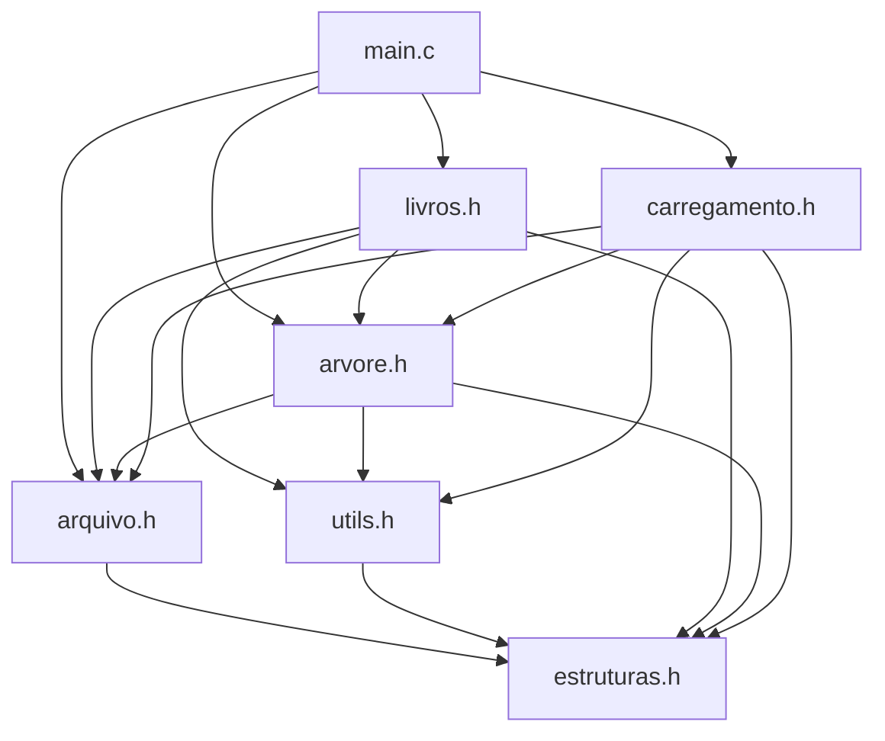

# 📁 Reorganização Modular do Sistema de Livros

## 🎯 **Objetivo Alcançado**
✅ **Código balanceado:** Nenhum arquivo com mais de 200 linhas  
✅ **Modularização lógica:** Funções agrupadas por responsabilidade  
✅ **Mantida conectividade:** Todas as dependências preservadas  
✅ **Facilita manutenção:** Cada módulo tem propósito específico  

---

## 📊 **Comparação: ANTES vs DEPOIS**

### **ANTES (Desbalanceado):**
```
livros.c      ~500+ linhas  ❌ Muito grande
carregamento.c ~100 linhas  ⚠️  Médio
arquivo.c     ~150 linhas   ⚠️  Médio
main.c        ~50 linhas    ✅ Pequeno
Headers       ~20 linhas    ✅ Pequenos
```

### **DEPOIS (Balanceado):**
```
arvore.c      ~180 linhas   ✅ Balanceado
livros.c      ~140 linhas   ✅ Balanceado  
utils.c       ~120 linhas   ✅ Balanceado
carregamento.c ~120 linhas  ✅ Balanceado
arquivo.c     ~150 linhas   ✅ Balanceado
main.c        ~50 linhas    ✅ Pequeno
Headers       ~15-30 linhas ✅ Pequenos
```

---

## 🏗️ **Nova Estrutura Modular**

### **1. `utils.h/utils.c` (120 linhas)**
**Propósito:** Funções utilitárias reutilizáveis
- ✨ `read_int()` - Leitura segura de inteiros
- ✨ `read_float()` - Leitura segura de floats (vírgula/ponto)
- ✨ `trim_string()` - Remoção de espaços
- ✨ `formatar_preco()` - Formatação com vírgula

### **2. `arvore.h/arvore.c` (180 linhas)**
**Propósito:** Operações da Árvore Binária de Busca
- 🌳 `buscar_livro()` - Busca na árvore
- 🌳 `inserir_na_arvore()` - Inserção BST
- 🌳 `remover_da_arvore()` - Remoção BST (3 casos)
- 🌳 `percorrer_in_ordem()` - Percorrimento ordenado
- 🌳 `imprimir_arvore_niveis()` - Visualização por níveis
- 🌳 `calcular_altura_arvore()` - Cálculo de altura

### **3. `livros.h/livros.c` (140 linhas)**
**Propósito:** Operações de alto nível com livros
- 📚 `cadastrar_livro()` - Interface de cadastro
- 📚 `imprimir_dados_livro()` - Exibição detalhada
- 📚 `listar_todos_livros()` - Listagem completa
- 📚 `calcular_total()` - Estatísticas
- 📚 `remover_livro()` - Interface de remoção
- 📚 `imprimir_lista_livres()` - Gerenciamento de espaço

### **4. `carregamento.h/carregamento.c` (120 linhas)**
**Propósito:** Carregamento em lote de arquivos
- 📁 `carregar_arquivo()` - Parser robusto
- 📁 Validação de formato
- 📁 Tratamento de erros
- 📁 Relatório de carregamento

### **5. `arquivo.h/arquivo.c` (150 linhas)**
**Propósito:** Operações de baixo nível com arquivo binário
- 💾 `ler_cabecalho()` - Leitura de metadados
- 💾 `atualizar_cabecalho()` - Escrita de metadados
- 💾 `ler_livro_posicao()` - Leitura de registros
- 💾 `escrever_livro_posicao()` - Escrita de registros
- 💾 `obter_nova_posicao()` - Gerenciamento de posições
- 💾 `adicionar_registro_livre()` - Lista de livres

### **6. `main.c` (50 linhas)**
**Propósito:** Interface principal e coordenação
- 🎮 `menu_principal()` - Interface do usuário
- 🎮 `main()` - Inicialização do sistema

---

## 🔗 **Dependências Mantidas**



---

## 🚀 **Vantagens da Nova Estrutura**

### **📈 Balanceamento**
- Nenhum arquivo gigante (>200 linhas)
- Distribuição equilibrada de responsabilidades
- Facilita navegação e manutenção

### **🎯 Especialização**
- **`utils.c`**: Funções genéricas reutilizáveis
- **`arvore.c`**: Lógica específica da estrutura de dados
- **`livros.c`**: Interface de alto nível
- **`carregamento.c`**: Processamento de arquivos texto
- **`arquivo.c`**: Persistência binária

### **🔧 Manutenibilidade**
- Mudanças em formatação → apenas `utils.c`
- Mudanças na BST → apenas `arvore.c`
- Mudanças na interface → apenas `livros.c`
- Mudanças no parser → apenas `carregamento.c`

### **✅ Testabilidade**
- Cada módulo pode ser testado independentemente
- Funções utilitárias facilmente testáveis
- Isolamento de responsabilidades

---

## 🛠️ **Como Aplicar**

### **1. Substitua os arquivos atuais:**
```bash
# Backup dos arquivos atuais
mkdir backup
cp *.c *.h backup/

# Copie os novos arquivos dos artifacts
# Crie o novo arquivo utils.c e utils.h
# Atualize os arquivos existentes
```

### **2. Compile com o novo Makefile:**
```bash
make clean
make
```

### **3. Teste o sistema:**
```bash
./livros
```

---

## 🎉 **Resultado Final**

✅ **6 módulos balanceados** (50-180 linhas cada)  
✅ **Responsabilidades bem definidas**  
✅ **Código mais organizado e legível**  
✅ **Facilita futuras expansões**  
✅ **Mantém toda funcionalidade original**  
✅ **Preserva correção de vírgulas/pontos**  

**O sistema agora está profissionalmente organizado! 🚀**